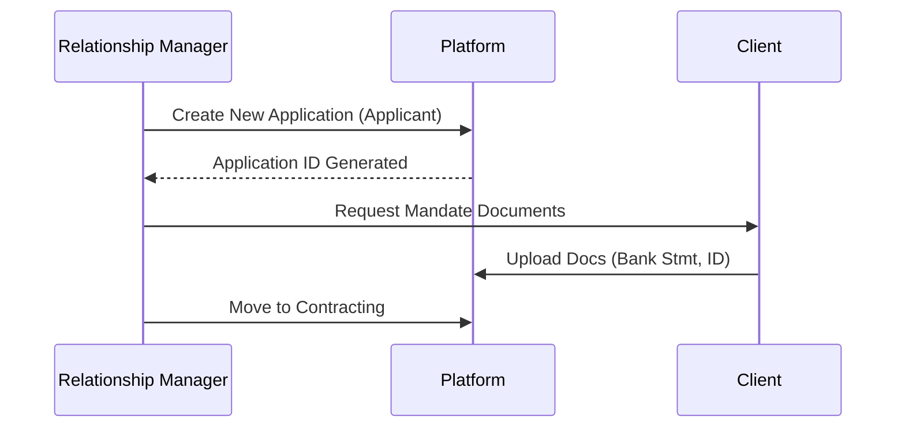
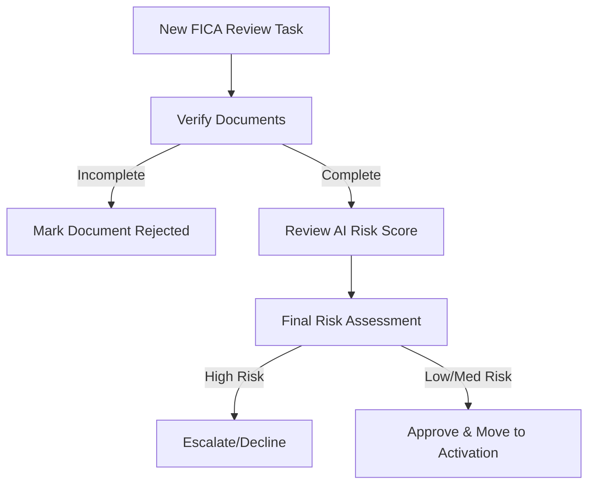

# StratCol Automated Client Onboarding Engine: User Guide

Welcome to the StratCol Onboarding Control Tower. This system is designed to streamline and automate the client onboarding process, moving from traditional paper-based methods to a digital, stage-based workflow.

## 1. Getting Started
When you log in, you will be presented with the **Control Tower Dashboard**. This is your primary workspace for tracking the progress of all active applications.

### Key Dashboard Elements:
- **Pipeline View**: A visual representation of your onboarding funnel. Applications move from left to right through 5 stages.
- **Stats Overview**: Quick-glance metrics for total applications, pending actions, and risk alerts.
- **Navigation Sidebar**: Access all applications, risk reviews, active clients, and platform settings.

## 2. The 5-Stage Workflow
Applications progress through a standardized journey:

1.  **Applicant**: Initial entry. A new application is created with basic company details.
2.  **Contracting**: Document signing and initial ITC credit checks.
3.  **FICA Review**: Human-in-the-loop verification of documents and AI risk scoring.
4.  **Activation**: Integration ready for V24 system.
5.  **Completed**: Client fully onboarded and active.

## 3. User Role Flows

### Relationship Manager (Sales)
Responsible for initiating applicants and ensuring clients provide necessary documentation.

### Risk Manager (Compliance)
Responsible for verifying FICA compliance and assessing financial risk.

## 4. Managing Applications
### Creating a New Application
- Click the **"New Application"** button.
- Complete the form with company registration and contact details.

### Advancing Stages
- Open an application to see its **Detail Page**.
- Click **"Advance to [Next Stage]"** to move the client forward. Note that some stages require documents or risk reviews to be completed first.

## 5. Risk Assessment & FICA
- **Document Management**: Upload and verify required documents in the Documents tab.
- **AI Risk Scoring**: The system generates a risk level (Green, Amber, Red) automatically.
- **Manual Review**: Risk Managers can add notes and manually finalize the risk assessment.

## 6. Audit & Activity
Every action is logged for compliance:
- View the **Activity Timeline** on any application detail page to see full history.
- Use the **Risk Review** dashboard for high-level oversight.

---
*For technical support, please contact your internal platform administrator.*
