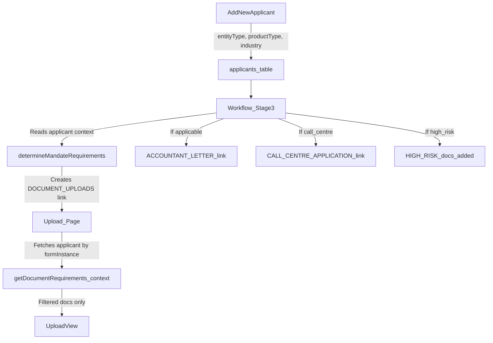

# Conditional Document Uploads and Tailored Forms

## Problem

The upload page at `/uploads/[token]` calls `getAllDocumentRequirements()` (`[config/document-requirements.ts:476](config/document-requirements.ts)`) which dumps every possible document onto the applicant. The `getDocumentRequirements(context)` function already exists with conditional logic but is never used. Additionally, `MANDATE_DOCUMENT_REQUIREMENTS` in `[inngest/functions/onboarding-v2.ts:198](inngest/functions/onboarding-v2.ts)` contains invented document types (`EFT_MANDATE_FORM`, `DEBIT_ORDER_MANDATE`) that do not exist in the official requirements.

## Architecture




---

## 1. DB Schema: Add `entityType` and `productType` to applicants

**File:** `[db/schema.ts](db/schema.ts)`

Add two new columns after `industry`:

- `entityType` (text, nullable) -- values: `"company"`, `"close_corporation"`, `"proprietor"`, `"partnership"`, `"npo"`, `"trust"`, `"body_corporate"`, `"other"`
- `productType` (text, nullable) -- values: `"standard"`, `"premium_collections"`, `"call_centre"`

Then generate a new Drizzle migration with `bun run db:generate` and apply with `bun run db:migrate`.

---

## 2. Form Updates Requirement "Add New Applicant" 

**File:** `[components/dashboard/applicant-form.tsx](components/dashboard/applicant-form.tsx)`

- Add `entityType` dropdown (Proprietor, Company, Close Corporation, Partnership, NPO, Trust, Body Corporate, Other) to the Company Information section
- Add `productType` dropdown (Standard, Premium Collections, Call Centre) to the Company Information section
- Update `ApplicantFormData` interface, validation, and form submission

**File:** `[app/api/applicants/route.ts](app/api/applicants/route.ts)` -- Accept and persist the new fields.

---

## 3. Rewrite Upload Page to Show Conditional Documents

**File:** `[app/(unauthenticated)/uploads/[token]/page.tsx](app/(unauthenticated)`/uploads/[token]/page.tsx)
Replace:

```typescript
const requirements = getAllDocumentRequirements();
```

With: Look up the applicant from `formInstance.applicantId`, build a `DocumentRequirementContext` from their `entityType`, `productType`, `industry`, `riskLevel`, then call:

```typescript
const requirements = getDocumentRequirements(context);
```

This is a server component, so the DB lookup is straightforward.

---

## 4. Update `config/document-requirements.ts` to Match Official Requirements

**File:** `[config/document-requirements.ts](config/document-requirements.ts)`

Align `DocumentRequirementContext` with new entity/product types:

- Expand `entityType` to include `"close_corporation"`, `"proprietor"`, `"partnership"`
- Add `productType?: "standard" | "premium_collections" | "call_centre"`
- Add `isHighRisk?: boolean`

Update `getDocumentRequirements()`:

- **Standard FICA** (always included): Entity docs, Individual docs, Business docs per the official spec
- **Entity-specific**: Proprietors skip Company Registration/Business Premises proof; NPOs need Constitution + Resolution + Board List; Trusts need Letter of Authority + Beneficiary IDs; Body Corporates need Resolution + Board List
- **Industry-specific**: Insurance -> FSCA; Security -> PSIRA; FIC -> FIC Registration; Loan/Debt -> NCR (already implemented, just verify)
- **Product-specific**: Premium Collections -> Intermediary Agreement; Call Centre -> COLMS upload only (the rest moves to the new Call Centre form)
- **High-risk additional**: INSTRUCTION_LETTER_CHANGES (existing users), SALES_AGREEMENT (sale of business), CONSENT_FORM (scanned upload)
- Remove items that are now handled by standalone forms (Accountant Letter, Call Centre fields)

---

## 5. Fix `MANDATE_DOCUMENT_REQUIREMENTS` in Workflow

**File:** `[inngest/functions/onboarding-v2.ts](inngest/functions/onboarding-v2.ts)` (lines 198-211)

Replace the invented document types with real ones from the official requirements. The mandate-specific requirements are really about the business type + standard FICA, not invented mandate forms. The `determineMandateRequirements` function should use the applicant's `entityType` and `productType` from the DB instead of free-text `businessType` from form data.

Update `BUSINESS_TYPE_DOCUMENTS` to match the official requirements spec exactly.

---

## 6. New Form Type: `ACCOUNTANT_LETTER`

### 6a. Add to FormType enum

**File:** `[lib/types.ts](lib/types.ts)` -- Add `"ACCOUNTANT_LETTER"` to `FormTypeSchema`

### 6b. Create form content definition

**File:** `[app/(unauthenticated)/forms/[token]/content.ts](app/(unauthenticated)`/forms/[token]/content.ts)

Add `ACCOUNTANT_LETTER` entry with:

- **Static preamble text** (the pro forma letter body with placeholders filled from applicant data)
- **Form fields:**
  - `businessName` (text, pre-filled from applicant, read-only display)
  - `physicalAddress` (textarea, required -- the accountant fills in the business address)
  - `accountantName` (text, required)
  - `practiceNumber` (text, required)
  - `confirmLegitimate` (checkbox, required -- "I confirm the business is legitimate and I am not aware of any investigation")
  - `signatureName` (signature, required)
  - `signatureDate` (date, required)

### 6c. Add Zod validation schema

**File:** `[lib/validations/forms.ts](lib/validations/forms.ts)` -- Add `accountantLetterSchema`

### 6d. Handle submission

**File:** `[app/api/forms/submit/route.ts](app/api/forms/submit/route.ts)` -- Add case for `ACCOUNTANT_LETTER` submission, fire an Inngest event `form/accountant-letter.submitted`

---

## 7. New Form Type: `CALL_CENTRE_APPLICATION`

### 7a. Add to FormType enum

**File:** `[lib/types.ts](lib/types.ts)` -- Add `"CALL_CENTRE_APPLICATION"` to `FormTypeSchema`

### 7b. Create form content definition

**File:** `[app/(unauthenticated)/forms/[token]/content.ts](app/(unauthenticated)`/forms/[token]/content.ts)

Add `CALL_CENTRE_APPLICATION` entry with sections:

- **Service Agreement** section (checkbox acceptance + signature)
- **Product Description** section (textarea)
- **Supplier Contact Information** section (text fields: name, phone, email, address)
- **Call Script** section (textarea)
- **Signature** section (signatureName, signatureDate)

### 7c. Add Zod validation schema

**File:** `[lib/validations/forms.ts](lib/validations/forms.ts)` -- Add `callCentreApplicationSchema`

### 7d. Handle submission

**File:** `[app/api/forms/submit/route.ts](app/api/forms/submit/route.ts)` -- Add case for `CALL_CENTRE_APPLICATION`, fire Inngest event `form/call-centre.submitted`

---

## 8. Update Workflow to Send Conditional Links

**File:** `[inngest/functions/onboarding-v2.ts](inngest/functions/onboarding-v2.ts)`

In Stage 3 "request-mandate-documents" step (line 695):

- Look up applicant's `entityType`, `productType`, `industry`, `riskLevel`
- Build array of links to send:
  - Always: `DOCUMENT_UPLOADS` (with conditional docs rendered by the page)
  - If business needs accountant letter: `ACCOUNTANT_LETTER` form link
  - If `productType === "call_centre"`: `CALL_CENTRE_APPLICATION` form link
- Send all applicable links in a single email via `sendApplicantFormLinksEmail()`

For high-risk applicants (riskLevel === "red"):

- Add FINANCIAL_STATEMENTS confirmation step for the risk manager
- The risk manager must confirm they sent and received financial statements before the workflow proceeds (new signal/event: `risk/financial-statements.confirmed`)

---

## 9. Add High-Risk Financial Statements Confirmation 

**File:** `[inngest/functions/onboarding-v2.ts](inngest/functions/onboarding-v2.ts)`

After risk assessment, if `riskLevel === "red"`:

- Create a notification for the risk manager to confirm financial statements were sent and received
- Wait for event `risk/financial-statements.confirmed` before proceeding
- This is in addition to the normal approval step -- high-risk applicants need both the financial statements confirmation AND the standard approval

**File:** `[inngest/events.ts](inngest/events.ts)` -- Add new event type definitions

---
