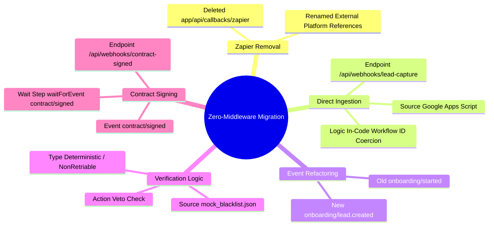

## Executive Summary

We have successfully transitioned the onboarding system from a Zapier-dependent architecture to a "Zero-Middleware" model. This shift eliminates external dependencies for core logic, improves reliability, and centralizes state management within the Inngest workflow.

Key achievements include:

- **Decommissioning Zapier**: All external webhook routes have been removed.
- **Direct Lead Capture**: Google Forms now POST directly to our Next.js API (`/api/webhooks/lead-capture`) using Google Apps Script.
- **Deterministic Verification**: Replaced probabilistic AI voting with a strict, hierarchical veto system (`mock_blacklist.json`).
- **Simplified "Signing"**: Implemented a mock contract signing flow using a second direct webhook (`/api/webhooks/contract-signed`).
- **Event-Driven Architecture**: Renamed `onboarding/started` to `onboarding/lead.created` to better reflect the domain event.

## System Architecture Mindmap

## Detailed Implementation

### 1. Direct Lead Capture

The entry point is now a direct POST request from Google Apps Script. This bypasses Zapier entirely, allowing for lower latency and better error handling.

**Endpoint**: `POST /api/webhooks/lead-capture`

### 2. State Management

The Inngest workflow (`inngest/functions/onboarding.ts`) is now the **single source of truth**. External webhooks no longer update the database status directly; they only emit events that the workflow reacts to.

### 3. Verification Veto

A `verification-veto-check` step was added to the start of the workflow. It checks the `Lead ID` against a local blocklist and terminates the workflow immediately if a match is found.

### 4. Contract Signing Mock

The "Quality Gate" step has been replaced with a wait-for-event pattern relying on `contract/signed`. This allows for asynchronous resolution of the signing stage via a second Google Form submission.
