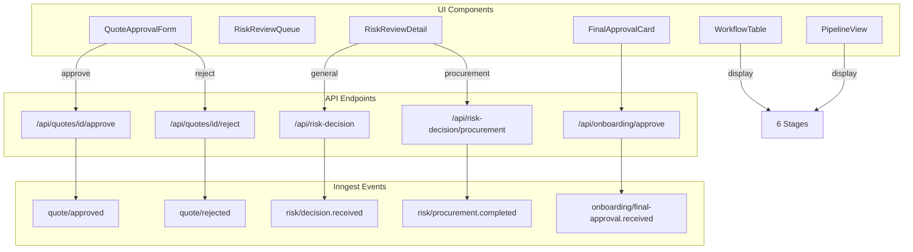

# UI Alignment with V2 Workflow

## Current State Analysis

The UI was designed for the original 4-stage workflow but the V2 workflow has 6 stages with additional events and actions. Key gaps identified:

### Stage Representation Mismatch


| V2 Stage | Name                         | Current UI Support            |
| -------- | ---------------------------- | ----------------------------- |
| 1        | Entry & Quotation            | Partially (as "lead_capture") |
| 2        | Quote Signing & Facility App | Partially (as "quotation")    |
| 3        | Mandate Determination        | Partially (as "verification") |
| 4        | AI Analysis & Final Review   | Missing                       |
| 5        | Contract & Completion Forms  | Missing                       |
| 6        | Integration & Completion     | Partially (as "integration")  |


### Missing UI Components

1. **Quote Rejection** - No UI to reject quotes (overlimit handling)
2. **Procurement Review** - No UI for procurement-specific risk decisions
3. **Final Approval Button** - No UI to trigger `onboarding/final-approval.received`
4. **Parallel Branch Visibility** - No indication of parallel mandate processing

---

## Implementation Plan

### Phase 1: Stage System Update

**Files to update:**

1. **[components/dashboard/workflow-table.tsx](components/dashboard/workflow-table.tsx)**
  - Change `WorkflowRow.stage` type from `1 | 2 | 3 | 4` to `1 | 2 | 3 | 4 | 5 | 6`
  - Update `WorkflowStageIndicator` to render 6 stages
  - Add stage name mapping:

```typescript
const STAGE_NAMES: Record<number, string> = {
  1: "Entry & Quote",
  2: "Quote Signing",
  3: "Mandate Processing",
  4: "AI Analysis",
  5: "Contract & Forms",
  6: "Completion",
};
```

1. **[components/dashboard/pipeline-view.tsx](components/dashboard/pipeline-view.tsx)**
  - Expand `PIPELINE_STAGES` to 6 columns
  - Update status-to-stage mapping for V2 workflow
  - Consider collapsible columns for space efficiency on smaller screens
2. **[app/(authenticated)/dashboard/workflows/page.tsx](app/(authenticated)/dashboard/workflows/page.tsx)**
  - Update stage distribution stats to show 6 stages

---

### Phase 2: Quote Management UI

**Files to update/create:**

1. **[components/dashboard/quote-approval-form.tsx](components/dashboard/quote-approval-form.tsx)**
  - Add "Reject Quote" button with reason input
  - Add overlimit warning display when `quote.amount > threshold`
  - Call `POST /api/quotes/[id]/reject` on rejection

```tsx
// Add rejection state and handler
const [showRejectModal, setShowRejectModal] = useState(false);
const [rejectReason, setRejectReason] = useState("");

async function handleReject() {
  await fetch(`/api/quotes/${quoteId}/reject`, {
    method: "POST",
    body: JSON.stringify({ reason: rejectReason, isOverlimit }),
  });
}
```

1. **Update quote detail display**
  - Show overlimit indicator when applicable
  - Display rejection reason if quote was rejected

---

### Phase 3: Risk Review Enhancement

**Files to update/create:**

1. **[components/dashboard/risk-review/risk-review-queue.tsx](components/dashboard/risk-review/risk-review-queue.tsx)**
  - Add "Review Type" indicator (General vs Procurement)
  - Filter by review type
2. **[components/dashboard/risk-review/risk-review-detail.tsx](components/dashboard/risk-review/risk-review-detail.tsx)**
  - Detect review type from workflow stage/context
  - Route to appropriate API endpoint:
    - Stage 3 procurement: `POST /api/risk-decision/procurement`
    - Stage 4 final review: `POST /api/risk-decision`
  - Add procurement-specific data display (ProcureCheck results, anomalies)

```tsx
// Determine review type based on workflow stage
const reviewType = workflow.stage === 3 ? "procurement" : "general";

// Call appropriate endpoint
const endpoint = reviewType === "procurement" 
  ? `/api/risk-decision/procurement`
  : `/api/risk-decision`;
```

---

### Phase 4: Final Approval Component

**New component to create:**

1. **Create `components/dashboard/final-approval-card.tsx**`
  - Display checklist: Contract signed, Absa form complete
  - "Complete Onboarding" button
  - Calls `POST /api/onboarding/approve`

```tsx
interface FinalApprovalProps {
  workflowId: number;
  applicantId: number;
  contractSigned: boolean;
  absaFormComplete: boolean;
}

function FinalApprovalCard({ workflowId, applicantId, contractSigned, absaFormComplete }: FinalApprovalProps) {
  const canApprove = contractSigned && absaFormComplete;
  
  return (
    <Card>
      <CardHeader>
        <CardTitle>Final Approval</CardTitle>
      </CardHeader>
      <CardContent>
        <Checklist items={[
          { label: "Contract Signed", checked: contractSigned },
          { label: "Absa 6995 Complete", checked: absaFormComplete },
        ]} />
        <Button disabled={!canApprove} onClick={handleApprove}>
          Complete Onboarding
        </Button>
      </CardContent>
    </Card>
  );
}
```

1. **Add to workflow detail page** when stage === 5 and status === "awaiting_human"

---

### Phase 5: Parallel Branch Visualization

**Files to update:**

1. **[app/(authenticated)/dashboard/workflows/[id]/page.tsx](app/(authenticated)/dashboard/workflows/[id]/page.tsx)**
  - Add parallel branch status display for Stage 3
  - Show both branches: Procurement Check + Mandate Documents

```
Stage 3: Mandate Processing
├─ Procurement Check: [Status] (Risk Score: X)
└─ Mandate Documents: [X/Y received]
```

1. **Create `components/dashboard/parallel-branch-status.tsx**`
  - Visual representation of parallel workflow branches
  - Status indicators for each branch

---

### Phase 6: UX Improvements

1. **Action-oriented notifications**
  - Update `notifications-panel.tsx` to route actions to correct endpoints based on notification type
  - Add context-aware action buttons
2. **Workflow progress stepper**
  - Create a horizontal stepper component showing all 6 stages
  - Indicate current stage, completed stages, and parallel processing
3. **Responsive pipeline view**
  - Collapsible columns for 6-stage view
  - Mobile-friendly card layout option
4. **Loading and error states**
  - Add skeleton loaders for async data
  - Consistent error messaging

---

## Architecture Diagram




---

## Files Summary


| File                                                      | Action                              | Priority |
| --------------------------------------------------------- | ----------------------------------- | -------- |
| `components/dashboard/workflow-table.tsx`                 | Update stage types and indicator    | High     |
| `components/dashboard/pipeline-view.tsx`                  | Expand to 6 stages                  | High     |
| `components/dashboard/quote-approval-form.tsx`            | Add rejection UI                    | High     |
| `components/dashboard/risk-review/risk-review-detail.tsx` | Add procurement routing             | Medium   |
| `components/dashboard/final-approval-card.tsx`            | Create new                          | Medium   |
| `app/(authenticated)/dashboard/workflows/[id]/page.tsx`   | Add final approval, parallel status | Medium   |
| `components/dashboard/parallel-branch-status.tsx`         | Create new                          | Low      |
| `docs/user-guides/workflows.mdx`                          | Update documentation                | Low      |


